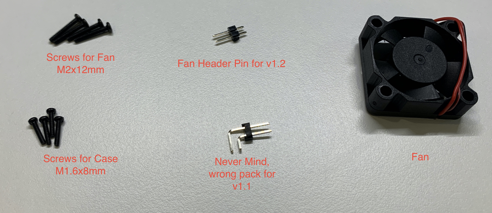
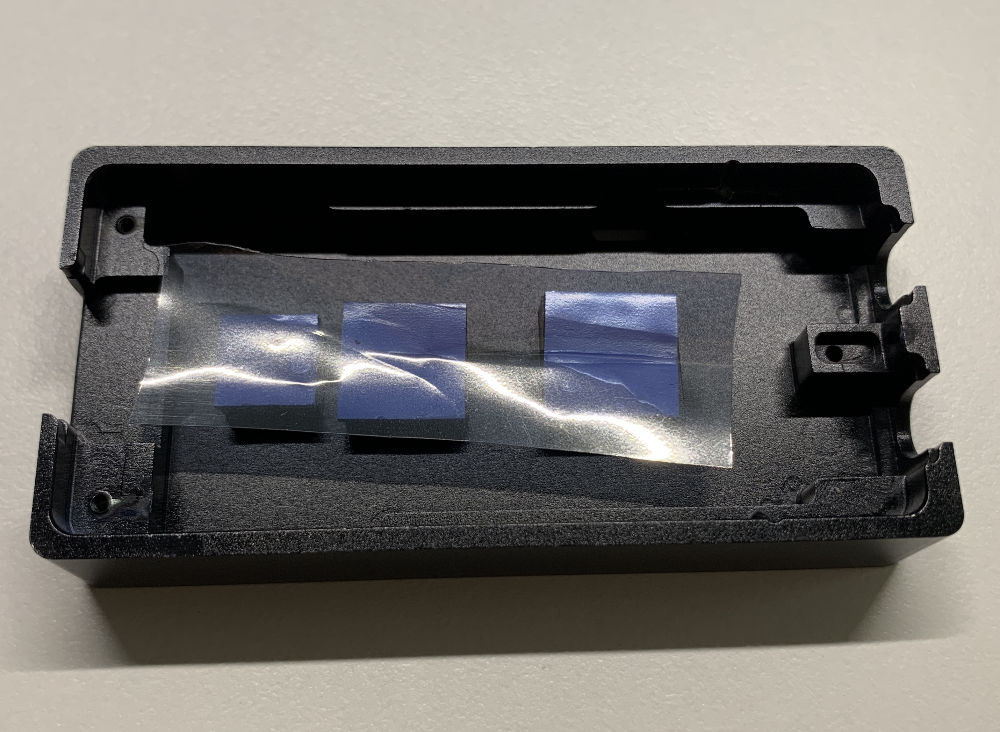

# Installation Instruction for Lime-AC-Case: Mini

Here is what inside the box: fan and screw pack, custom rf shield and foam, case.

Accessories inside the fan and screw pack.

## Preparation.
All you need is just a Phillips PH0 screwdriver. If your board is v1.1 you will need another [2 Position 2.54 mm 1 Row Right Angle Pin (Male) Headers](https://www.mouser.com/ProductDetail/Molex/22-28-6100?qs=sGAEpiMZZMs%252BGHln7q6pmxD%2F5kNJnZVeZUjU%2FPShYi4%3D) as the fan header pins.

## Step 1: Assemble the RF shield.

Accessories inside the transparent bag.

First, remove the part inside the foam.

Then remove the sticky cover.

Tap the foam on top of the metal shield. **Notice: The hole is not in the center of the foam be aware of the direction.**

## Step 2: Soldering the fan header pins.
**You can skip this step if you don't want the active cooling function.**

Soldering the fan header pin for v1.2 on to the J10 connector on the board, if your board is v1.1 use the [1 Row Right Angle Pin (Male) Headers](https://www.mouser.com/ProductDetail/Molex/22-28-6100?qs=sGAEpiMZZMs%252BGHln7q6pmxD%2F5kNJnZVeZUjU%2FPShYi4%3D) instead. 

For v1.2 board, the J10 connector is on the edge of the PCB nearby the RF shield, For v1.1 board the connector close to the USB port.

**After soldered use a multi-meter to make sure the two pins are not short. Then combine the board with the bottom case to check if the pins are touching the bottom case or not. If touching the case, cut off the excess or resolder.**

Connect the fan and plug into the USB port to test the fan, if the fan spins, everything works fine, or just check the cable is connecting right.
For the v1.2 board, the pin on the SMA side is positive, for v1.1 board, the positive pin close to the edge.

## Step 3: Install the custom RF shield.

Remove the original RF shield and replace it with the custom one. Be aware of the direction, the LMS7002 chip should be in the center of the hole.

## Step 4: Assemble the case.

Remove the plastic cover that covers the thermal pad.

Put the board in the top case. For the v1.1 board, you should connect the fan first.

Put the bottom on and screw the four M1.6x8mm screws.

Install the fan and secure it with the M2x12mm screws. You can rotate the fan to find the best angle to manage the cable.

###All Finish, have fun with the case.