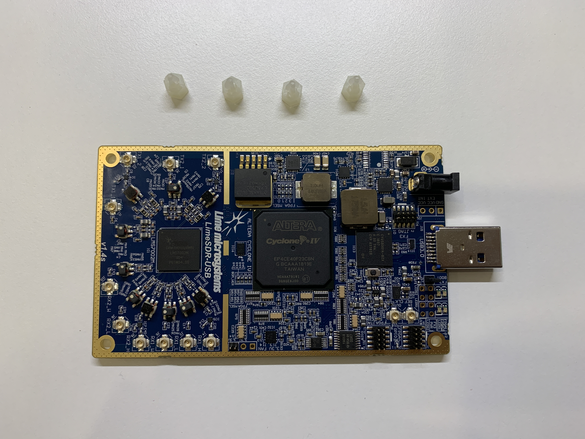

# Installation Instruction for Lime-AC-Case: Tetra

Here is what inside the box: fan, case, SMA to U.F.L cables, accessories pack.

Accessories.

## Preparation.
All you need is just Phillips PH0, PH2 screwdrivers, and Flat Round Tip Straight Tweezer.

## Step 1: Soldering the fan header pins.
**You can skip this step if you don't want the active cooling function.**

Remove the nylon support.

Soldering the fan header pin to the J14 connector on the board. 

**After soldered use a multi-meter to make sure the two pins are not short. Then combine the board with the bottom case to check if the pins are touching the bottom case or not. If touching the case, cut off the excess or resolder.**

Connect the fan and plug into the USB port to test the fan, if nothing wrong, the fan will spin and stop immediately.

**Notice: Fan will be turned on if the board will heat up to 55°C and FAN will be turned off if the board will cool down to 45°C.**

## Step 2: Mounting the PCB on the bottom case.

First, Make sure your board can be slid into the case, if not, just bend the USB port and made it level with the board.

Put the thermal paste on the memory chips and the nake crop on the bottom.

Slide the board back into the bottom case and secure it with the M2x3mm screws.

## Step 3: Install the clock cables and the LED indicator.

Put the LED indicator into the LED holes.

 - Mount the SMA-U.F.L cable to the CLK hole, and connect the U.F.L to the REF Clock connector show as **"In"**.
 - Mount the SMA-U.F.L cable to the REF hole, and connect the U.F.L to the REF Clock connector show as **"Out"**.

**Make sure no cables is on top of the USB chip and inductor.**

## Step 4: Install the RF cables(the hardest part).
In this part, a Flat Round Tip Straight Tweezer could be a lot of help.

It's not much difficult to install the TX cables, just make sure not to break the "GU" filter and no cables on top of the LMS7002 and Mosfet.

When you deal with the RX2_W connector, twine the cables so that it wouldn't on top of the LMS7002.

Then the RX2_L, just don't damage the "GU" filter.

RX2_H.

The bend the RX1_W and RX1_L cable into "S" shape, and deal with the U.F.L connectors as the above picture shows.

The last is RX1_H, similar to RX1_W and RX1_L.

## Step 5: Install Top case.

Paste the thermal paste on LMS7002, FPGA, USB Chip, Inductors and Mosfet.

Put the Fan cables through the top case and connect to the Fan header pins. The red cable should be connected to the positive pin.

Close the case slowly, make sure no cable is cliped. If the case can't be closed, open a seam and poke the clamped cables in with tweezers.

Secure the Fan with the M3x12mm screws.

Turn the case around, and screw all the M1.6*8mm screws.

###All Finish, have fun with the case.